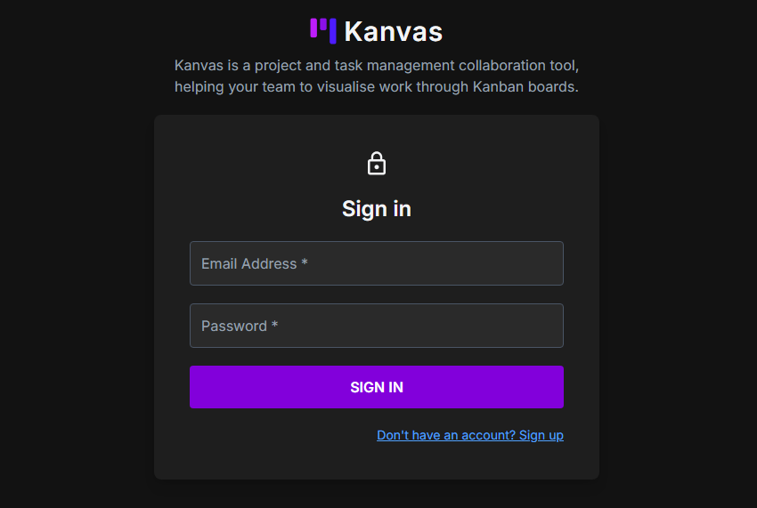
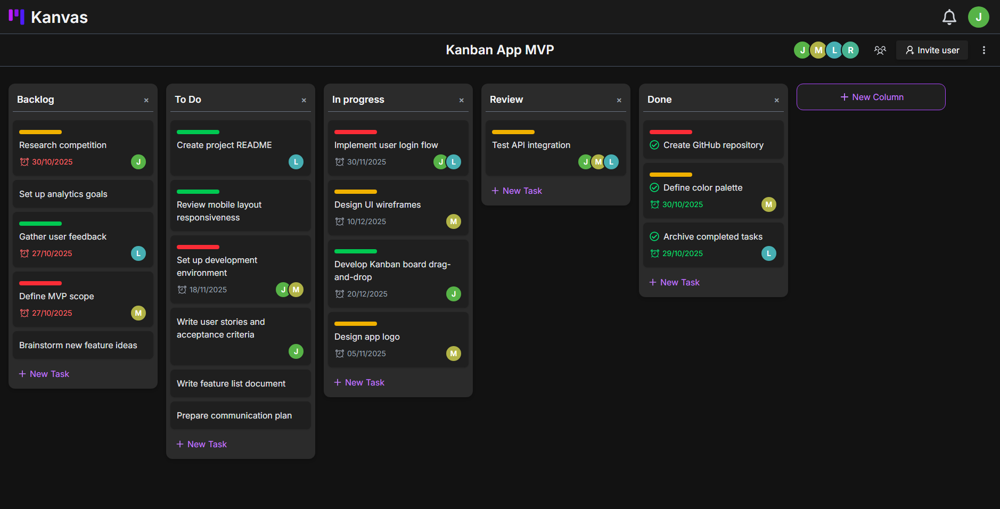
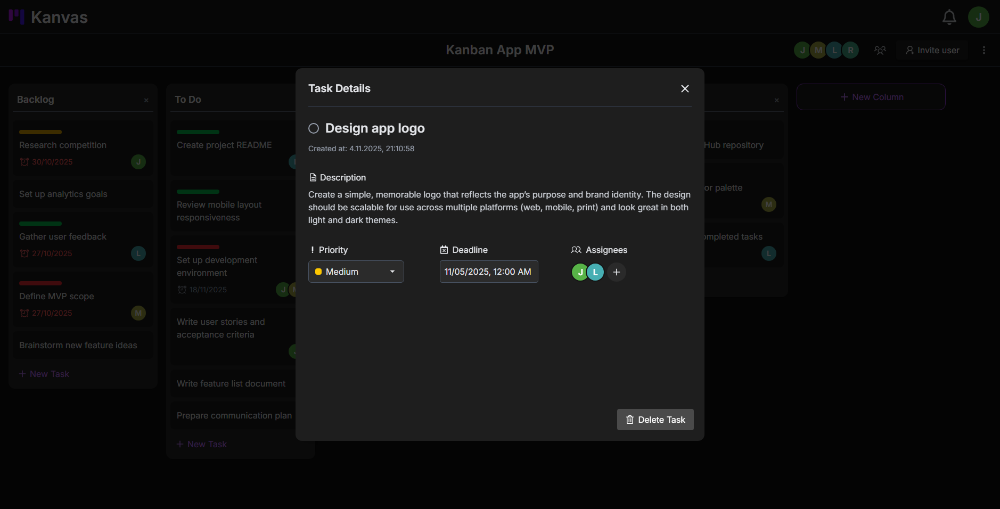

# 🚀 Kanvas - Project and task management Kanban application

## Overview
Kanvas is a fullstack solution for project and task managenent. The backend of Kanvas was designed and implemented in the microservices architecture that aims to structure an application as a collection of loosely coupled and independent services, where each of one them focuses on a specific business or domain logic. 

Kanvas allows users to create create Kanban boards gathered in workspaces. Users are able to create columns, tasks, as well as move them freely across the board.

The application was built using Spring Boot on the backend side and React with TypeScript on the frontend. The backend was containerized using Docker and is deployed in a single docker-compose file (possible migration to Kubernetes in the future). 

## Features
- Registration and login
- Real-time notifications
- Create workspaces and invite other users 
- Create Kanban boards in workspaces
- Board and workspace roles and permissions
- Read only board view for users with VIEWER role
- Create, edit & delete columns and tasks
- Drag and drop functionality for columns and tasks
- Live board updates between collaborating users

## Tech stack
| Technology       | Description                                                          |
| ---------------- | -------------------------------------------------------------------- |
| Spring Boot      | Java Backend framework                                               |
| PostgreSQL       | Open source database management system for microservices             |
| Apache Kafka     | Message broker for asynchronous communication                        |
| React            | Frontend framework for creating dynamic single page applications     |
| Docker           | Containerization platform                                            |

## Architecture overview

### Infrastructure
- **Config Server** - provides configuration for other microservices.
- **WebSocket Service** - publishes WebSocket messages to the frontend in order to update the state of Kanban boards and deliver notifications.
- **API Gateway** - authorizes incoming requests and proxies them to correspodning domain .microservices based on preconfigured API routes. Also handles load balancing.
- **Discovery Server** - discovers running services, needed for API Gateway.
- **Message Broker** - asynchronous communication in the system.
- **Databases** - each domain microservices has its own database, in order to maintain loose coupling and microservices independence.

### Domain Microservices
- **User Service** - responsible for account creation and users authentication. Generates JWT Tokens that are later verified in the API Gateway.
- **Board Service** - contains logic concerning workspaces and board, their membership with roles and permissions.
- **Tasks Service** - manages columns, tasks and their assignees. 
- **Notification Service** - creates, publishes and stores user notifications based on most important system events published in the message broker.

Each of the services runs as a separate container, enabling horizontal scaling. The whole system works as single docker-compose, with only the API Gateway port exposed, ensuring a single entry point to the system.

## User Interface
### Login Page

### Board View

### Task Details

## Deployment
Coming soon