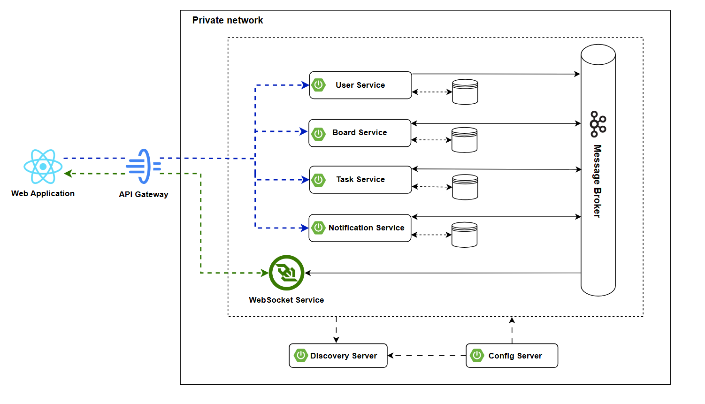

# 🚀 Kanvas - Project and task management Kanban application

## Overview
Kanvas is a fullstack solution for project and task managenent. The backend of Kanvas was designed and implemented in the microservices architecture that aims to structure an application as a collection of loosely coupled and independent services, where each of one them focuses on a specific business or domain logic. 

Kanvas allows users to create create Kanban boards gathered in workspaces. Users are able to create columns, tasks, as well as move them freely across the board.

The application was built using Spring Boot on the backend side and React with TypeScript on the frontend. The backend was containerized using Docker and is deployed in a single docker-compose file (possible migration to Kubernetes in the future). 

## Features
Coming soon

## Tech stack

| Technology       | Use Case                                                             |
| ---------------- | -------------------------------------------------------------------- |
| Spring Boot      | Java Backend framework                                               |
| JWT Tokens       | Authorization and session management                                 |
| PostgreSQL       | Open source database management system for microservices             |
| Apache Kafka     | Message broker for asynchronous communication between microservices  |
| React            | Frontend framework for creating dynamic single page applications     |
| WebSockets       | Real time notifications and  updates among users on Kanban boards    |
| Docker           | Containerization platform                                            |

## Architecture overview

## User Interface
Coming soon

## Deployment
Coming soon